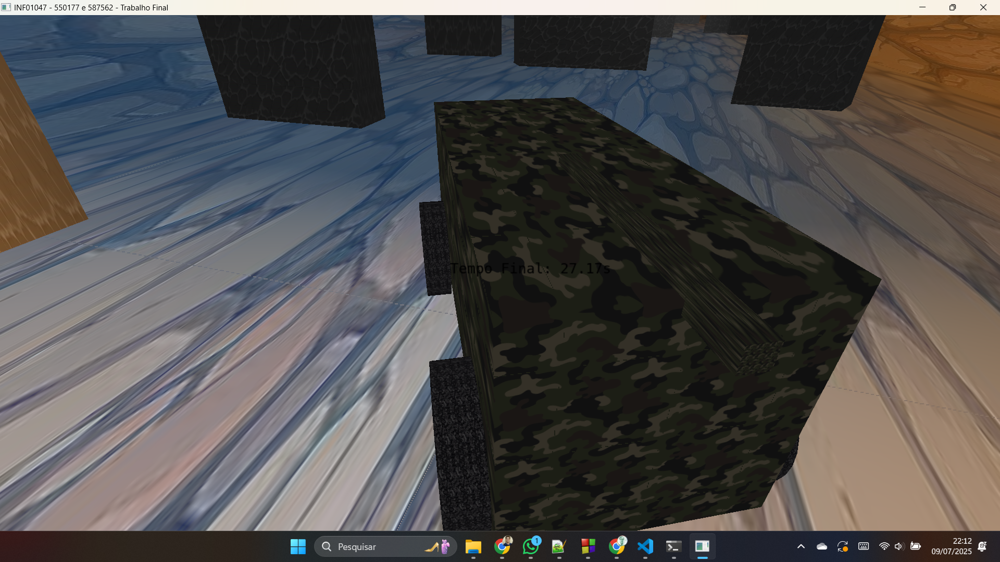

# Trabalho de Computação Gráfica

Este jogo de estilo corrida contra o tempo é o trabalho final de FCG/2025
Este trabalho utiliza várias instâncias de um mesmo objeto para renderizar o protagonista, os bloqueios e a arena.
O usuário atua controlando o protagonista (um tanque), que causa transformações geométricas em suas rodas ao fazê-las girar com animação baseada no tempo ($\Delta t$).
Para completar o objetivo (chegar no final e encontrar os coelhos feitos de malhas poligonais complexas!) permite-se observar a arena tanto através de uma câmera fixa no protagonista, quanto uma camera central da arena.
Mas cuidado! as paredes se movimentam em curvas de Bézier para complicar seu objetivo! Para melhorar os efeitos visuais, o tanque tem uma textura militar, a arena e os obstáculos contam com uma textura de muro de pedra, e a roda conta com uma textura de roda de tanque de guerra!
Para poder observar com qualidade os detalhes desse jogo, todos os objetos recebem um modelo de Iluminação Difusa e Blinn-Phong, e objetos como o protagonista recebem também os modelos de Interpolação de Phong e Gouraud.

---

## Contribuição dos Integrantes

- Bruno: Ficou responsável por implementar:
- - [jogabilidade e estrutura da arena](../../issues/11) (Implementado)
- - [Animações baseadas no tempo $\Delta t$](../../issues/10) (Implementado)
- - [Testes de Intersecção](../../issues/5) (Parcialmente Implementado [Apenas intersecção de reta plano para o canhão {Reta-Esfera e Reta-Triângulo possuem um protótipo, mas é falho}])
- - [Transformação das Rodas e Movimentação](../../issues/2) (Implementado)
- - [Instância de objetos](../../issues/4) (Implementado [Todos os paralelepipedos da cena são criados em cima do mesmo modelo])
- - Jogabilidade e estrutura da arena (Funcionalidade opcional) [Testes de sobreposição de AABB utilizados para colisão mais eficiente]
- Marcelo: Ficou responsável por implementar:
- - [modelos de Iluminação Difusa e Blinn-Phong](../../issues/6) (Implementado)
- - [Modelos de Interpolação de Phong e Gouraud](../../issues/7) (Implementado)
- - [Câmera livre e câmera look-at](../../issues/3) (Implementado)
- - [Malhas poligonais complexas](../../issues/1) (Implementado)
- - [Movimentação com curva Bézier cúbica](../../issues/9). (Implementado)
- Ambos ficaram responsáveis pelas [texturas](../../issues/8) (Implementado)

---

## Uso de Ferramentas de IA

Fizemos uso do ChatGPT, que foi muito útil, especialmente em debug. Usei (marcelo) bastante para a parte das texturas e na importação do objeto de malha complexa (coelho).
Já o meu uso (Bruno), foi principalmente para a criação do Mesh dos cillindros, no auxilio de alguns cálculos (mesmo seguindo as orientações dos slides tive alguns erros que me ajudou a resolver intersecção/física) e para correção de Bugs, se mostrou extremamente útil quando eu especificava com precisão já identificando os conceitos trabalhados na disciplina e por onde estava o erro (caso pedisse algo amplo sem dar um contexto muito específico ele mais atrapalhava que ajudava (por exemplo no mapeamento das texturas))

---

## Desenvolvimento e Aplicação dos Conceitos de Computação Gráfica

Utilizamos vários conceitos trabalhados em aula, como

- Transformações Hierárquicas (LAB3)
- - Chaci, Rodas e Canhão
- Texturas (LAB5)
- - Arena, tanque, obstáculos, rodas, etc.
- Iluminação (LAB4)
- Modelo Local (LAB2)
- - Para aplicar texturas localmente

---

## Imagens da Aplicação

### Protagonista

### Tela Inicial

---

## Manual de Uso

- **W A S D:** movimentam o objeto principal
- **Tecla `F` | Tecla `T`:** troca a câmera
- **Tecla `Esc`:** fecha a aplicação
- **Tecla `Espaço`:** Atira

---

## Compilação e Execução

Execute `./bin/Release/main.exe`

## Principais dificuldades
- Bruno:
    Tive problemas principalmente nos testes de colisão, onde pretendia utilizar as normais das faces do carro e seus ponto futuros para lidar com a colisão, mas isso resultava em um colisão imperfeita que tinha dificuldades de tratar cenários específicos de colisão diagonal, assim optei por utilizar uma abordagem de sobreposição de AABB, que também teve uma implementação trabalhosa, mas rendeu um resultado satisfatório.
  O segundo maior problema foi para corrigir as texturas esticadas, tive muitas dificuldades devido ao Cubo de modelo do Lab3 utilizar vértices de [-1,0], padrão que eu não estava familiarizado, no fim, depois de muito trabalho, minha solução foi trocar a posição dos vértices para o intervalo padrão [-0.5,+0.5], isso exigiu alta refatoração do código, mas foi capaz de corrigir os problemas.
